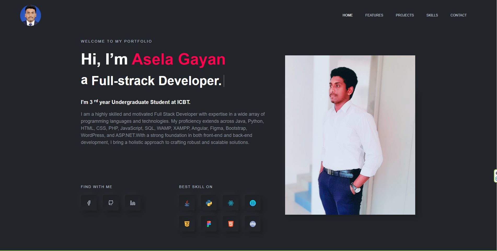

# portfolio-asela-gayan
using html and CSS ,PHP,JS,Boostrap,reactjs

<h2>🚀 Welcome to My GitHub Portfolio!

Greetings, explorers of code! I am [Your Name], a passionate and innovative software developer on a journey to transform ideas into elegant, functional, and impactful solutions. 🌟

<h2>👨‍💻 About Me:
With a relentless curiosity for technology and a commitment to continuous learning, I specialize in [mention your primary tech stack or area of focus, e.g., Full-Stack Web Development]. My mission is to contribute to the digital landscape by crafting clean, efficient, and user-centric applications.

<h2>🚀 What I Bring to the Table:
<ul>
<li>Tech Stack: [List your primary programming languages, frameworks, and tools]</li>
<li>Problem Solver: A creative thinker who enjoys tackling complex challenges and implementing innovative solutions.</li>
<li>Team Player: Thriving in collaborative environments, I believe in the power of teamwork to achieve remarkable outcomes</li>.
</ul>
<h2>🛠️ Highlighted Projects:
<ul>
<li>[Project Name 1]: Hotel management System.</li>
<li>[Project Name 2]: Event Management System.</li>
...
</ul>
<h2>🔗 Connect with Me:

<l3>[LinkedIn]([Asela Gayan](https://www.linkedin.com/in/asela-gayan-503687212/))  URL - https://asela-portfolio.web.app</l3>

  
<h2>🌈 Let's Collaborate:

Open to collaboration, feedback, and new opportunities. Whether you're a fellow developer, recruiter, or enthusiast, let's connect and create something extraordinary together! 🚀

<h2>Project GUI</h2>

⭐ Thank you for visiting my GitHub repository! Feel free to explore, fork, and provide feedback. Happy coding! ⭐
